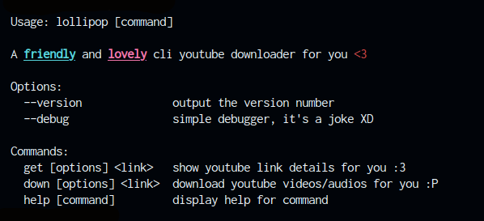

# lollipop 🍭

A friendly and lovely cli youtube downloader written in typescript for Linux, MacOS, Windows.



## Features
- Download video and audio separately
- Auto merging you download video and audio together
- Convert audios to mp3

## Requirement
- Lollipop use [ffmpeg](https://ffmpeg.org/), so you should installed that

## Installation (Linux/MacOS)
- Run this command on your terminal to install lollipop:
 
  ```bash
  curl -fsSL https://raw.githubusercontent.com/sudospaes/lollipop/main/install.sh | bash
  ```

## Installation (Windows)
**No installer has been written for Windows yet**
- Download latest version from [release](https://github.com/sudospaes/lollipop/releases)
- Rename downloaded file to `lollipop`
- Open terminal or cmd and run lollipop:

    ```ps
  ./lollipop.exe
  ```
    
## How to use (example)
  Lollipop uses tags to download from YouTube. You have to provide it your desired video tag and audio tag, for example, the command below:
  ```bash
  Linux/MacOS : lollipop down youtube_link -v tag_number -a tag_number
  ```
  ```ps
  Windows : ./lollipop.exe down youtube_link -v tag_number -a tag_number
  ```
   If you won't do that. It's be fine. just type ```lollipop down youtube_link``` to lollipop downloading highest qualities for you or
  ```bash
  Linux/MacOS : lollipop down youtube_link -v highest -a highest
  ```
  ```ps
  Windows : ./lollipop.exe down youtube_link -v highest -a highest
  ```
  Lollipop has not left you alone to get the tag number. You can get the information with using get command, see this example:
  ```bash
  Linux/MacOS : lollipop get https://youtu.be/-dYB0xfE7qs?si=29PqrPHpJ2Xd1lah
  ```
  ```ps
  Windows : ./lollipop.exe get https://youtu.be/-dYB0xfE7qs?si=29PqrPHpJ2Xd1lah
  ```
  You will get this output from lollipop:
  <br>
  
  <br>
  Now you know video tag and audio tag. so, run this command to download them and auto-merging with lollipop:
  ```bash
  Linux/MacOS : lollipop down https://youtu.be/-dYB0xfE7qs?si=29PqrPHpJ2Xd1lah -v 137 -a 251
  ```
  ```ps
  Windows : ./lollipop.exe down https://youtu.be/-dYB0xfE7qs?si=29PqrPHpJ2Xd1lah -v 137 -a 251
  ```
## All commands and flags
| Command | Description |
|:-----|:----------------:|
|`get`| Get youtube links infomation |
|`down`| Download from youtube |

| Flag name | Description |
|:-----|:----------------:|
|`-v`| It's for provide video quality |
|`-a`| It's for provide audio quality |
|`--mp3`| Convert audio to mp3 |
